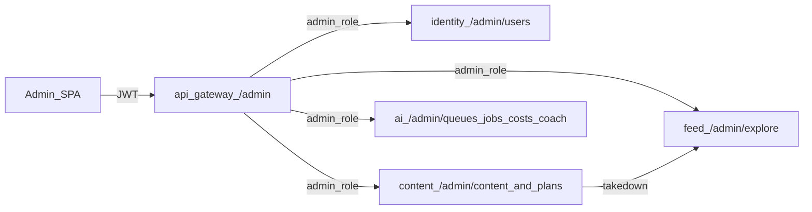

# nxClip Admin Panel — Spec & Admin API Reference (Single Source of Truth)

> **This document is the single source of truth for the admin panel scope AND the `/admin/*` API contract.**
> It merges the backend team's `admin-api-reference.md` + `admin-panel-beta-apis.md` (absorbed 2026-08-07)
> into the original MVP implementation review. **Any future backend API doc is merged here** — test the
> changes against the app first, then fold them in. See the maintenance note at the end.
>
> **API surface verified live** against the production gateway on 2026-08-07 (seeded admin, real probes).
> Live status + open backend items are tracked in the single status report: `reports/nxclip-admin-report.md`.
> Latest backend handoff `documentsProvided/admin-api-reference.md` reviewed on 2026-09-16; the `/admin/*`
> route contract still matches this file exactly.

---

## 1. Status at a glance (2026-08-07)

The `/admin/*` surface — assumed "missing" in the original review — **has since been implemented and is
live.** The admin SPA runs against the production gateway by default and renders real data on every module
except cost (blocked on a backend 500).

| Module | Endpoint(s) | Live status |
|---|---|---|
| Auth | `/auth/login`, `/auth/me`, `/auth/refresh`, `/auth/logout` | ✅ live (BE-11 resolved 2026-08-26) |
| System Health | `GET /admin/health` | ✅ live |
| Creator Directory | `GET /admin/users` + active/roles/reset-onboarding | ✅ live |
| Content Moderation | `GET /admin/content` + approve/takedown | ✅ live |
| Drafts & Processing | `GET /admin/content?status=draft` / `?status=processing` | ✅ live (page added 2026-09-09) |
| AI Queues | `GET /admin/queues`, `GET /admin/jobs`, retry | ✅ live |
| AI Cost | `GET /admin/costs/summary` | ❌ **500 (BE-1)** |
| Explore Audit | `GET /admin/explore` | ✅ live (`?sort=` 400s → client-side sort) |
| Stuck Publishing | `GET /admin/content?status=publishing` | ✅ live (no dedicated route) |
| Plan Limits | `GET/PUT /admin/plans` | ✅ live |
| AI Coach | `GET/POST/PATCH /admin/coach/*` | ✅ live |

Open backend items are tracked as **BE-1…BE-11** (see §2.8). **BE-11 was resolved on 2026-08-26** — live
admin access works again and every module below was re-verified against the real gateway that day. The one
remaining P0 is **BE-1** (cost panel 500, still failing as of 2026-08-26).

---

## 2. Admin API Reference

Call **only the public API Gateway**. Do not call identity/content/ai/feed Cloud Run URLs from the browser.

### 2.1 Base URLs

| Environment | Gateway base URL |
|---|---|
| **Production (GCP Cloud Run)** | `https://api-gateway-216098834386.us-central1.run.app` |
| **Local** | `http://localhost:5000` |

Frontend env (`app/.env` — optional; the app defaults to same-origin + the dev proxy):

```env
# Point the client at a cross-origin gateway (requires CORS on the gateway).
VITE_API_URL=https://api-gateway-216098834386.us-central1.run.app
# Backend docs also name this alias; the current admin SPA reads VITE_API_URL.
VITE_API_GATEWAY_URL=https://api-gateway-216098834386.us-central1.run.app
```

All paths below are relative to the base (e.g. `POST {base}/auth/login`, `GET {base}/admin/users`).

### 2.2 Auth + seeded admin

**`POST /auth/logout` requires the refresh token in its body (changed 2026-09-09).**
It accepted a bodiless call as recently as 2026-08-29; it now answers **400** with an ASP.NET
validation envelope:

```json
{ "title": "One or more validation errors occurred.", "status": 400,
  "errors": { "RefreshToken": ["..."] } }
```

Send `{ "refreshToken": "<token>" }` (PascalCase `RefreshToken` is also accepted). Verified live:
a correct call returns **204** and genuinely revokes the token — the following `/auth/refresh` returns
**401**.

**Why this mattered.** The FE cleared its local session in `onSettled`, so the 400 was invisible: the
operator appeared signed out while the refresh token stayed valid until expiry. Fixed 2026-09-09,
with an e2e test asserting the request body rather than just the redirect, because the redirect
passes either way.

**Note the error shape.** Identity returns ASP.NET ProblemDetails with PascalCase field names, while
the gateway and the other services return NestJS-style `{ message[], error, statusCode }`. Anything
parsing error bodies has to handle both.

All `/admin/*` routes require:

```http
Authorization: Bearer <accessToken>
```

JWT must include role **`admin`** (claim `roles` and/or the Microsoft role claim). Non-admins receive `403`.
Prefer `GET /auth/me` → `roles.includes('admin')` for the SPA guard, **and** a server-side role check on
`/admin/*` (defense in depth).

**Seeded admin** (enabled when Identity runs in Development, or `ADMIN_SEED_ENABLED=true` on the identity
Cloud Run):

| Field | Default |
|---|---|
| Email | `admin@nxclip.com` (override `ADMIN_SEED_EMAIL`) |
| Password | `Admin123!` (override `ADMIN_SEED_PASSWORD`) |

```http
POST {base}/auth/login
Content-Type: application/json

{ "email": "admin@nxclip.com", "password": "Admin123!" }
```

Use the returned `accessToken` for subsequent `/admin/*` calls. Confirm roles via `GET {base}/auth/me`
(expect `roles` to include `admin`).

**Quick checks (GCP):**

| Check | URL |
|---|---|
| Gateway health | `GET {base}/health` |
| Admin health aggregate | `GET {base}/admin/health` (Bearer admin JWT) |
| Gateway Swagger | `{base}/docs` |

### 2.3 Route map (via gateway)

Paths are the same on local and GCP; only the host changes.

| Method | Path | Upstream | Purpose |
|--------|------|----------|---------|
| GET | `/admin/health` | gateway | Aggregate service health dots |
| GET | `/admin/users?q=&cursor=&limit=` | identity | Creator directory search |
| GET | `/admin/users/stats?from=&to=` | identity | User signup + plan-mix aggregates (dashboard) |
| GET | `/admin/users/:id` | identity | User detail — **sole source of `contentCount` + `emailVerified`** (the list DTO omits both); FE merges it over the selected row |
| PATCH | `/admin/users/:id/active` | identity | `{ "isActive": true\|false }` |
| POST | `/admin/users/:id/roles` | identity | `{ "role": "admin"\|"creator", "action": "grant"\|"revoke" }` |
| POST | `/admin/users/:id/reset-onboarding` | identity | Clear DB onboarding + AI Coach Redis session |
| GET | `/admin/content?status=&cursor=&limit=` | content | Moderation / content queue |
| GET | `/admin/content/:id` | content | Inspector detail (`failureReason`, `failedAt`, …) — FE merges it over the selected row, keeping the open panel authoritative after approve/takedown |
| POST | `/admin/content/:id/approve` | content | Force-approve → continue publish path |
| POST | `/admin/content/:id/takedown` | content | Soft-delete + remove feed projection |
| GET | `/admin/plans` | content | FREE / PRO / STUDIO thresholds |
| GET | `/admin/plans/:plan` | content | One plan (`FREE`\|`PRO`\|`STUDIO`) — FE uses it as the **post-save read-back**: `PUT` returns 204 with no body, so this confirms what was actually stored and surfaces server-side clamping |
| PUT | `/admin/plans/:plan` | content | Update thresholds (`-1` = unlimited) |
| GET | `/admin/explore?cursor=&limit=` | feed | WES-sorted Explore audit (see §2.8 BE-8: no `sort` param) |
| GET | `/admin/queues` | ai | Queue depths / inline mode |
| GET | `/admin/jobs?status=&queue=&userId=&contentId=&cursor=&limit=` | ai | AI job list |
| POST | `/admin/jobs/:id/retry` | ai | Retry failed job |
| GET | `/admin/costs/summary?from=&to=` | ai | Cost aggregates — **currently 500 (BE-1)** |
| GET | `/admin/coach/categories?activeOnly=` | ai | Niche categories + readiness (`isReady`, `missingQuestionNumbers`) |
| POST | `/admin/coach/categories` | ai | Create category |
| GET | `/admin/coach/categories/:id` | ai | Category detail + embedded questions. **Consumed 2026-09-16** when opening the coach editor so edits start from a fresh category snapshot; embedded questions are not used for the bulk editor because inactive coverage is still verified through `GET .../questions?includeInactive=true`. |
| PATCH | `/admin/coach/categories/:id` | ai | Update / deactivate category |
| PATCH | `/admin/coach/categories/reorder` | ai | Bulk `{ items: [{ id, sortOrder }] }` for picker order. **Consumed 2026-09-09** — the coach page's Reorder mode sends the whole order renumbered `1..n`, because a swap cannot be expressed as two independent `PATCH /:id` writes without briefly colliding on a number. |
| GET | `/admin/coach/categories/:id/questions?includeInactive=` | ai | Questions for category |
| PUT | `/admin/coach/categories/:id/questions` | ai | **NEW 2026-08-29** — bulk upsert all Q&A (1–20) for the save form: `{ deactivateMissing, questions[] }` |
| POST | `/admin/coach/categories/:id/questions` | ai | Add single question |
| GET | `/admin/coach/questions/:id` | ai | **NEW 2026-08-29** — one question + parent category |
| PATCH | `/admin/coach/questions/:id` | ai | Update / deactivate question |

**Not real routes** (the FE derives these; see §2.8): `/admin/content/queue-count` (collides with
`/content/:id`, 400) and `/admin/publishing` (use `?status=publishing`); there is no `/redispatch`
(use `approve`).

**Content `status` values:** `draft`, `processing`, `generation_failed`, `publishing`,
`moderation_rejected`, `published`, `deleted`. (`status=all` is **not** valid — omit the param for "all".)

**Slug rule RELAXED — verified live 2026-08-29.** The server now answers
`slug must be alphanumeric (kebab-case, snake_case, or PascalCase)`; the old message was
`slug must be lowercase kebab-case`. Accepted: `gaming`, `Gaming`, `digital-creator`,
`UPPER_SNAKE`. Rejected: any value containing a space, under 2 chars, over 64 chars.
**The FE `SLUG_RE` was widened to match — fixed 2026-09-09.** It is now
`/^[A-Za-z0-9]+(?:[-_][A-Za-z0-9]+)*$/`, and `normaliseSlug` repairs separators without touching
case, so `Gaming` and `UPPER_SNAKE` are enterable. Live now carries both conventions and cannot
be cleaned up (there is no DELETE): the five oldest categories use `Gaming` / `General` / `Food`,
the thirteen newer ones kebab-case. Treat slugs as opaque keys, not as derivable from the label.

**`limit` maximum is 100** on `/admin/content` and `/admin/jobs` — `limit=200` returns
`400 {"message":["limit must not be greater than 100"]}`. `/admin/users` currently tolerates larger
values, but the FE caps every list at 100 for consistency. Verified live 2026-08-26. Any derived
series is therefore bounded to one page of ≤100 rows until server-side aggregation exists.

### 2.4 Plan limits body (`PUT /admin/plans/:plan`)

| Field | Meaning |
|-------|---------|
| `dailyImageGenerations` | Daily gens; `-1` unlimited |
| `dailyUploadLimit` | Daily uploads; `-1` unlimited |
| `maxReferenceImages` | Max reference images on generate |
| `maxClipOutputSeconds` | Max rendered clip length |
| `maxClipSourceSeconds` | Max source clip length |
| `maxUploadSizeMb` | Max upload size |
| `canUseAnalyticsReport` | Analytics report entitlement |

Runtime enforcement reads the **DB** (`content.plan_limits`) with code defaults as fallback. Stripe
assignment of `User.Plan` stays on Identity — admin edits **entitlement numbers**, not Stripe price IDs.

### 2.5 Coach category / question shapes

**Category:** `slug`, `label`, `openingMessage`, `progressLabel`, `sortOrder`, `isActive` (+ read-only
`id`, `questionCount`, `createdAt`, `updatedAt`).

**`GET /admin/coach/categories/:id` is used as the editor's fresh category read.** Measured live
2026-09-09 it adds exactly one field over a list row (`questions`), so it does not replace the
question-bank fetch. The editor still reads questions through
`GET .../questions?includeInactive=true`, because the bulk save must hold inactive rows too. The
detail read is valuable for category copy/status freshness when opening the side panel, not as a
round-trip reduction.

**Category readiness fields** — present on both the list and the new detail route, verified live
2026-08-29. **All six are consumed** (coach page, 2026-09-09): `activeQuestionCount` over
`requiredQuestionCount` is the Questions column, `isReady` + `missingQuestionNumbers` drive the
Onboarding column and the page banner, `sortOrder` drives Reorder mode, and `questionCount` less
`activeQuestionCount` surfaces as `+n off` — the difference between a row that is switched off
(a toggle) and a number never written (a new question).

| Field | Meaning |
|---|---|
| `requiredQuestionCount` | Always `5` — onboarding needs Q1–Q5 |
| `activeQuestionCount` | Count of `isActive=true` questions |
| `questionCount` | Total rows including inactive |
| `isReady` | `true` when Q1–Q5 all have active rows |
| `missingQuestionNumbers` | e.g. `[3, 5]` — the gaps blocking onboarding |
| `sortOrder` | Picker order, lower first; managed via `PATCH .../reorder` |

Questions also carry `options` as an alias of `chips`, plus `multiSelect`. A duplicate
`questionNumber` within a category returns **409**. Onboarding uses exactly 5 active questions
per category; Q0 is the runtime category picker and is not stored as a row.

**Adding a question proposes `max(questionNumber) + 1`** — fixed 2026-09-14. It previously used
the row count, which collides whenever a set has a gap below its highest number (`Q1 Q2 Q4 Q5`
has four rows, so it proposed the Q5 that already existed). That is the exact shape the button
exists to repair, so the add path failed precisely in the case it was for. The editor now names
the slot before the write and flags a number past Q5 as one onboarding will never ask.

**Create validation** (`POST /admin/coach/categories`) — enumerated live 2026-08-26, not previously
documented. All four text fields are **required**:

| Field | Rule |
|---|---|
| `slug` | alphanumeric — kebab-case, snake_case or PascalCase; 2–64 chars (**relaxed 2026-08-29**, see §2.3) |
| `label` | 1–128 chars |
| `progressLabel` | 1–128 chars — **required** (was easy to miss; a blank value 400s) |
| `openingMessage` | ≥ 1 char |

The FE mirrors all four client-side and *suggests* a slug from the label (`"Tech & Gadgets"` →
`"tech-gadgets"`) until the field is edited by hand, after which it stops deriving. The 1–128
caps on `label` and `progressLabel` are enforced in the dialog as of 2026-09-14; before that only
the slug's own bounds were mirrored, so an over-long label reached the API as an unexplained 400.
**Question:** `questionNumber`, `message`, `chips[]`, `multiSelect`, `isActive` (+ read-only `id`,
`categoryId`, timestamps).
Prefer soft-deactivate (`isActive: false`) over hard delete to avoid breaking in-flight sessions.
`PATCH /admin/coach/questions/:id` is consumed by each question row's Active switch; text, chips,
question order, and multi-select still use the bulk `PUT /admin/coach/categories/:id/questions` save
so draft edits commit together.

### 2.6 Known response shapes (observed live 2026-08-07)

The backend has **not** published response DTOs yet (BE-5); these were captured by probing and are enforced
by the SPA's Zod schemas (the authoritative field-level detail is this section and §2.3).

- **users item:** `id, email, username, displayName, plan(FREE|PRO|STUDIO), isActive, roles[], onboardingCompleted, createdAt`
- **content item:** `id, userId, title, description, status, contentType, prompt, basePrompt, refinePrompt, style, aspectRatio, thumbnailUrl, cdnUrl, storageKey, jobId, failureReason, failedAt, publishedAt, createdAt, updatedAt` — note `contentType` is an open string (observed `image`, `meme`, `clip`) and `aspectRatio` varies (`1:1`, `16:9`, `9:16`, `3:1`, …); the FE treats both as free strings, not enums.
- **queues:** `{ mode, queues: [{ name, waiting, active, failed, delayed }] }`
- **jobs item:** `id, jobType, queueName, bullJobId, contentId, userId, status, promptVersion, inputPayload, resultPayload, errorMessage, correlationId, createdAt, updatedAt`
- **explore item:** `contentId, userId, wesScore, socialRollup, hasLiveExternal, title, contentType, likeCount, commentCount, publishedAt, createdAt` (flat `{ items }` — no totals/cursor)
- **health:** `{ status, services: [{ key, url, ok, statusCode }] }`
- **users/stats** (live): `{ totalUsers, activeUsers, byPlan{FREE,PRO,STUDIO}, signups{ last7d, last30d, byPlanLast7d, byPlanLast30d } }` (+ `inRange`/`byPlanInRange` when `from`+`to` set). Soft-deleted users excluded; plan counts reflect current `users.plan`.
- **costs/summary** (blocked, BE-1): the *intended* DTO is `{ totalUsd, byDay[], byProvider[{ provider, totalUsd, unitCount }], topUsers[{ userId, totalUsd }] }` — **not** the fabricated `spendTodayUsd/spend30dUsd/deltaPct/daily` the FE mocks today. The FE cost schema + UI must be rewritten to this shape once BE-1 lands.
- **plan / coach category / coach question:** as in §2.4 / §2.5.

### 2.7 Suggested FE modules

1. System Health → `GET /admin/health`
2. **Users & subscriptions (dashboard)** → `GET /admin/users/stats` (total / active / FREE·PRO·STUDIO / 7d·30d signups)
3. Content Moderation Hub → content list + approve/takedown
4. Creator Management → users + roles + reset onboarding
5. Queues / Costs → AI queues, jobs, costs
6. Global Config → `/admin/plans` + `/admin/coach/*`
7. Explore audit → `/admin/explore`

Defer: Social Distribution console, runtime AI provider toggles.

### Dashboard home composition
There is no single `/admin/dashboard` API — the Overview page composes parallel calls into widget rows:
- **Platform status** — `GET /admin/health` (service dots).
- **Users & subscriptions** — `GET /admin/users/stats` (total + plan mix + 7d/30d signups). ✅ built.
- **Moderation backlog** — counts by review status (publishing / moderation_rejected / generation_failed), derived from `/admin/content`.
- **AI queues / failed jobs** — `GET /admin/queues` (mode + per-queue depths + total failed) and a recent-failures list from `GET /admin/jobs?status=failed`.
- **AI spend** — `GET /admin/costs/summary` (blocked, BE-1).
Do **not** put on the dashboard: fabricated DAU/MAU, Stripe revenue, social OAuth timelines, or model toggles (not in Beta APIs) — and never fake numbers when an API is missing; show an "unavailable" state.

### 2.8 Open backend items (relay list)

| # | Ask | Priority |
|---|-----|----------|
| BE-1 | Fix `GET /admin/costs/summary` **500**. Target DTO (per backend doc): `{ totalUsd, byDay[], byProvider[{provider,totalUsd,unitCount}], topUsers[{userId,totalUsd}] }` — FE cost schema/UI must switch to this once fixed. | **P0** |
| BE-2 | Add `displayName` (+`username`) to `content`, `jobs`, `explore` item DTOs (only `userId` today) | **P1** |
| BE-3 | Confirm or drop moderation `priority` + `flags[]` | P2 |
| BE-4 | Provide queue KPI trend source (jobs-today / failed-over-time) or confirm none | P2 |
| BE-5 | Publish response DTOs / OpenAPI for all `/admin/*` (lock schemas) | **P1** |
| BE-6 | Optional native moderation queue-count (or a `total` on `/admin/content`) — FE derives today | P3 |
| BE-7 | Confirm stuck-publishing = `content?status=publishing`; expose **outbox** state/attempts/lag or confirm dropped; confirm re-drive = `approve`. (FE already enriches the inspector pipeline via `GET /admin/jobs?contentId=`; only the raw `content_outbox` dispatch state is missing.) | P2 |
| BE-8 | `GET /admin/explore?sort=` returns **400** — accept `sort` (+pagination) or document client-side only | P2 |
| BE-9 | Inline-mode: `/admin/queues` failed counters are 0 while `/admin/jobs?status=failed` has real failures — document authoritative counts | **P1** |
| BE-10 | **Admin can't view *pre-publication* media.** `cdnUrl`/`thumbnailUrl` → `/content/:id/media`, which is owner-scoped. **Published** content renders fine (media is public), but `publishing` / `draft` / `generation_failed` / `moderation_rejected` items return **403** for admin — exactly the states moderation needs to preview. Add an admin-scoped media route (`/admin/content/:id/media`) or a short-lived signed URL on the admin content DTO. | **P1** |
| ~~BE-11~~ | ✅ **RESOLVED 2026-08-26.** Re-tested end to end: `POST /auth/login` → 200 and `GET /auth/me` with that token → 200. Live admin access works again; the charts and detail routes are now verified against real gateway data. *(Original report kept below for history.)* ~~**Login issues a token that `/auth/me` immediately rejects.**~~ `POST /auth/login` returns **200** with an access token, but the very next `GET /auth/me` returns **401**, so the SPA clears the session and bounces to `/login`. FE refresh-and-retry is correct and does fire (`api/client.ts` retry-once + `features/auth/session.ts` refresher), but `POST /auth/refresh` also fails, so recovery is impossible. **This blocks all live admin use** — every page reads empty. Verified repeatedly 2026-08-25 against the production gateway with the seeded admin. Likely a signing-key / audience / issuer mismatch between the auth issuer and the gateway verifier, or a clock/expiry problem. | **P0** |

| BE-13 | **No plan-at-signup / subscription history.** `GET /admin/users` returns only each
account's *current* `plan`, and the 2026-08-29 reference confirms plan counts are "current
`users.plan` … not historical plan at signup". The Overview therefore **cannot answer "is the
paid share rising"** — every point on the plan-mix curve applies today's plans to whoever existed by
that date, so only the latest point is a measurement, and because older accounts have had longest to
upgrade the curve dilutes downward as newer cohorts arrive (it can fall while conversion improves).
Both charts are now labelled to say so. Fix: expose plan-at-signup on the user DTO, or a
subscription-events/plan-history source. | **P2** |

**Ops prerequisite:** the gateway must allow the admin SPA origin in **CORS** (with credentials) for a
cross-origin deploy. Local dev proxies around this.

---

## 3. Architecture (Option B — gateway `/admin/*` + service admin APIs)



- Browser never calls `/internal/*`.
- Gateway requires JWT **and** `admin` role, then proxies by path prefix.
- Each service also enforces admin via a shared `RolesGuard` (defense in depth).

**Gateway routing (prefix → upstream):**

| Prefix | Upstream |
|--------|----------|
| `/admin/users` | identity |
| `/admin/content`, `/admin/plans` | content |
| `/admin/explore` | feed |
| `/admin/queues`, `/admin/jobs`, `/admin/costs`, `/admin/coach` | ai |
| `/admin/health` | gateway-owned aggregator (parallel `/health` fan-out) |

---

## 4. Module-by-module review (statuses updated to current reality)

### 1. Content Moderation Hub — ✅ live (highest priority)

| Feature | Status | Notes |
|---------|--------|-------|
| Review queue | ✅ live | `GET /admin/content` filtered by status (publishing / rejected / failed / published / deleted / all) |
| Inspector (media + prompt) | ✅ live | Media via `cdnUrl`; prompt/style/aspect on DTO. Moderation `flags`/`priority` **not** persisted (BE-3) |
| Manual Approve | ✅ live | `POST /admin/content/:id/approve` |
| Reject / Take-down | ✅ live | `POST /admin/content/:id/takedown` (+ feed projection cleanup) |
| Aspect ratios | ✅ | Inspector respects `1:1` / `16:9` / `9:16` |
| Stuck-publishing view | ✅ live | Via `?status=publishing` (no dedicated `/admin/publishing` — BE-7). Inspector enriches the pipeline via `GET /admin/jobs?contentId=` (moderation/generation status); raw `content_outbox` state not exposed (BE-7) |
| `failureReason` / `failedAt` | ✅ | Exposed on the admin DTO |

### 2. Creator Directory — ✅ live (second priority)

| Feature | Status | Notes |
|---------|--------|-------|
| Search email/username | ✅ live | `GET /admin/users?q=` |
| Plan badge | ✅ live | `plan` on the item DTO |
| Suspend/reactivate | ✅ live | `PATCH /admin/users/:id/active` (`users.is_active`) |
| Onboarding reset | ✅ live | `POST /admin/users/:id/reset-onboarding` (clears DB + Coach Redis) |
| Role promotion to admin | ✅ live | `POST /admin/users/:id/roles` `{ role, action }` |
| Seeded admin login | ✅ live | `admin@nxclip.com` (see §2.2) |

Creator `displayName` present on users; **not** yet on content/jobs/explore DTOs (BE-2).

### 3. Social Distribution & Sync Console — DEFER (unchanged)

Tables exist under `feed.*` (`social_distributions`, `social_accounts`); OAuth adapters still return
stubs. Do **not** build the console UI. The thin substitute — a read-only **Explore audit** sorted by
`wesScore` — is built and live (§4.5).

### 4. AI Pipeline & Queue Dashboard — ✅ live (narrow scope)

| Feature | Status | Notes |
|---------|--------|-------|
| BullMQ queues | ✅ live | `image-generation`, `moderation`, `transcription`, `onboarding` (+ `mode: inline` on Cloud Run) |
| Jobs list + retry | ✅ live | `GET /admin/jobs?status=failed`, `POST /admin/jobs/:id/retry` |
| Cost aggregate | ❌ **500** | `GET /admin/costs/summary` (BE-1) |
| Model toggles at runtime | Defer | Env-driven (`AI_IMAGE_PROVIDER`, etc.) |
| Inline-mode failed counts | ⚠️ | Queue counters read 0; real failures live in `/admin/jobs` (BE-9) |

### 5. Explore WES Audit — ✅ live (P2 substitute)

Read-only `GET /admin/explore` (flat `{ items }`); ranked by `wesScore` client-side (server 400s on
`sort` — BE-8). Flat `likeCount`/`commentCount` (no views/shares); `socialRollup` shown; no ghost flag.

### 6. Global Config — ✅ live (new)

Plan Limits (`GET/PUT /admin/plans`) and AI Coach categories + questions CRUD
(`GET/POST/PATCH /admin/coach/*`).

---

## 5. Data map (schemas)

### Identity — `identity.*`
- `users` — directory; `is_active` for suspend.
- `user_roles` + `roles` — admin gate (prefer over a `users.roles` column).
- `onboarding_completed`, `onboarding_plan` — reset tool clears DB **and** Coach Redis progress.
- `subscriptions` / plan claim — Free/Pro/Studio badge.

### Content — `content.*`
- `status` — full 7-value enum (§2.3).
- `content_type` — `image` / `clip` (note: `meme` is a **style**, not a type).
- `failure_reason`, `failed_at` — exposed on admin DTO.
- `prompt`, `style`, `aspect_ratio`, `storage_key`, `cdn_url` — inspector essentials.
- `content_outbox` — stuck-publish diagnostics (internals not exposed to admin yet — BE-7).
- `plan_limits` — one row per plan (FREE/PRO/STUDIO), admin-editable (§2.4).

### Feed — `feed.*` (not `social.*`)
- `feed_projections` — `wes_score`, `social_rollup`, `has_live_external`, like/comment counts.
- `social_distributions`, `social_accounts` — schema `feed`.

### AI — `ai.*`
- `ai_jobs` — `jobType`, `queueName`, `status`, `userId`, `contentId`, `errorMessage`, `correlationId`.
- `ai_costs` — `unit_count`, `cost_usd` (not `tokens_in`/`out`/`duration_ms`).
- `coach_categories` / `coach_questions` — §2.5.
- Queues — the four names above.

---

## 6. Implementation status (backend build plan — Option B)

Delivered (verified live 2026-08-07):

1. ✅ **Access foundation** — seeded admin, JWT `roles` claim + `RolesGuard`, gateway `/admin` authz.
2. ✅ **Identity** `/admin/users*` (list, active, roles, reset-onboarding).
3. ✅ **Content** `/admin/content*` (list, approve, takedown) + feed projection cleanup.
4. ✅ **AI** `/admin/queues`, `/admin/jobs`, Coach category/question CRUD. `/admin/costs/summary` **500 (BE-1)**.
5. ✅ **Plan limits** — `content.plan_limits` + `/admin/plans` CRUD, DB-backed enforcement.
6. ✅ **`/admin/health` + `/admin/explore`**.

Still open: BE-1…BE-11 (§2.8). **Still deferred:** Social Distribution console, runtime model toggles,
platform-wide analytics mega-dashboard, notification broadcast center.

---

## 7. UI/UX notes (design system)

Desktop-first, high-density ops console — sophisticated, high-contrast, structural minimalism.

- **Theme:** cool midnight canvas + high-contrast slate borders; lavender primary.
- **Typography:** geometric display for nav/headers; monospace (JetBrains Mono) for telemetry figures,
  queue IDs, UUIDs.
- **Anti-slop:** no nested cards — flat, borderless tables separated by whitespace + dividers; clean pill
  badges (emerald=live, amber=publishing, red=failed).
- **Layout:** 70/30 split — 70% high-density scrollable table, 30% inspector sidebar that updates on row
  select (act without leaving the view).
- **Left rail:** System Health (status dots: Identity, Content, AI, Notification, Feed), Content Moderation
  (with queue count), Creator Management, AI Queues, Stuck Publishing, Explore Audit, Global Config
  (Plan Limits, AI Coach), System Health, Settings.
- Status pills match real content statuses. System Health dots hit real `/admin/health`, not static green.

---

## 8. Maintenance — single source of truth

- **This file is the canonical admin API + spec doc.** The backend's earlier `admin-api-reference.md` and
  `admin-panel-beta-apis.md` were merged here on 2026-08-07 and removed from `NewDocs/`.
- **Latest backend handoff reviewed:** `documentsProvided/admin-api-reference.md` on 2026-09-16. Its
  `/admin/*` route map is identical to §2.3; this file remains the admin panel API source of truth.
- **Process for future backend docs:** when the backend team sends a new API doc, (1) test the changes
  against the admin app, (2) merge the confirmed changes into this file, (3) note them in the changelog
  below, (4) remove the standalone doc so this stays the only source.
- **Live status report** lives at `docs/reports/nxclip-admin-report.md` — a single report covering
  category-wise endpoint status, the backend action items (BE-1…BE-11), and the backend Cursor prompt
  (appendix). It references this file as the contract.

### Changelog
- **2026-09-16** — AI Coach now consumes `GET /admin/coach/categories/:id` for fresh editor category
  detail and `PATCH /admin/coach/questions/:id` through each question row's Active switch. The
  standalone `GET /admin/coach/questions/:id` remains intentionally unused pending a separate UX decision.
- **2026-09-16** — Reviewed latest backend-provided `documentsProvided/admin-api-reference.md` against this
  file. The `/admin/*` route map, seeded admin credentials, gateway base URL, plan/coach/content/users/jobs
  endpoints, and `users/stats` contract are aligned. Added the backend-documented
  `VITE_API_GATEWAY_URL` alias note while preserving `VITE_API_URL` as the variable the current SPA reads.
- **2026-08-07** — Merged backend `admin-api-reference.md` + `admin-panel-beta-apis.md`. Updated all module
  statuses from "missing/build" to live-verified. Added §2 Admin API Reference (base URLs, auth, route map,
  plan/coach shapes, observed response shapes) and §2.8 open items BE-1…BE-9.
- **2026-08-07** — Stuck Publishing inspector now enriches its pipeline from `GET /admin/jobs?contentId=`
  (real moderation/generation status), leaving only raw `content_outbox` state as a backend gap (BE-7).
- **2026-08-20** — Merged backend updates ("admin-api-reference.md" v2 + "What the Admin Panel is for"):
  added the live `GET /admin/users/stats` endpoint (§2.3/§2.6) and built the **Users & subscriptions**
  dashboard card; documented the **Dashboard home composition**; recorded the real `costs/summary` DTO
  shape against BE-1. Confirmed `contentType` = image/meme/clip and `socialRollup` = idle|scheduled|
  publishing|live|failed (FE already treats both as open strings). All data tables now use the paginated
  DataGrid (sort/filter/multi-select).
- **2026-08-25** — **API coverage is now complete: every route in §2.3 is consumed.**
  `GET /admin/plans/:plan` is wired as a **post-save read-back** — `PUT` returns 204 with no body, so the
  editor re-reads the single plan and reports any field the server stored differently
  (`Daily image generations: 9,999 → 1,000`) instead of echoing the submitted value; the form resets to the
  stored state and the list cache is seeded with the authoritative row.
  **Open question for backend:** the real clamping rules / ceilings are undocumented — the FE detects
  adjustments generically, but §2.4 should state the valid range per field. Newly consumed: **`GET /admin/users/:id`** and
  **`GET /admin/content/:id`**, wired as *progressive enrichment* — the list row renders immediately and the
  detail response merges over it via `lib/merge-defined.ts`. Detail schemas are `.partial()` and the merge
  skips `undefined`, so an unpublished/partial DTO (BE-5) can neither fail validation nor blank out a field
  the list supplied. This is what makes the Creator inspector's `contentCount` / `emailVerified` render at
  all. Mocks were made faithful to live (list handler strips both fields). Job inspector now renders
  `inputPayload` / `resultPayload` with data URIs collapsed to a size summary, for triaging provider
  rejections (see report §3a). Creator **names** now resolve in Moderation / Stuck Publishing / Explore
  tables *and* inspectors (client-side `useUserNames` workaround for BE-2). Added **BE-11** (P0): login
  issues a token `/auth/me` rejects, blocking all live admin use. Corrected report §3a — the
  image-generation 400 is **not** a client-supplied reference image; the client sends no image field at all.
  Layout: pages are full-width with equal gutters, detail panels open only on row-select, and the undefined
  `--spacing-topbar` / `--spacing-sidebar` tokens are now defined (the topbar had been collapsing to 37px).
